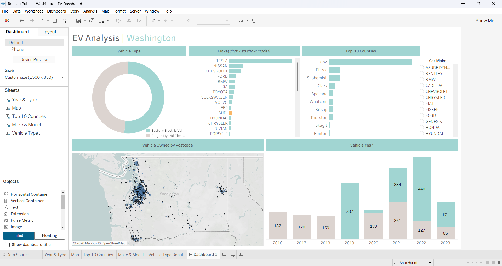

🚗 Washington EV Data Analysis (Tableau Dashboard)

📊 Project Overview

This project presents an interactive data visualization of Electric Vehicle (EV) adoption in Washington State using Tableau. The dashboard provides insights into EV distribution, trends, and key patterns across different regions and vehicle types.

---

🎯 Objectives

- Analyze the growth of electric vehicles in Washington
- Identify trends in EV adoption over time
- Compare different EV types (BEV vs PHEV)
- Visualize geographic distribution of EVs
- Provide an interactive dashboard for easy exploration

---

🛠️ Tools & Technologies

- Tableau (for data visualization)
- Excel / CSV (data source)
- GitHub (for project sharing)

---

📁 Dataset

The dataset includes:

- Vehicle type (Battery Electric Vehicle, Plug-in Hybrid Electric Vehicle)
- Model year
- County / Location
- Electric range
- Manufacturer details

---

📈 Dashboard Features

- 📍 Geographic map showing EV distribution
- 📊 Bar charts comparing EV types
- 📅 Trend analysis over years
- 🔍 Interactive filters for detailed exploration

---

🌐 Live Dashboard

👉 "View on Tableau Public" (https://public.tableau.com/views/WashingtonEVDashboard_17754622077580/Dashboard1?:language=en-US&publish=yes&:sid=&:redirect=auth&:display_count=n&:origin=viz_share_link)

---

📸 Dashboard Preview

---

🚀 Key Insights

- Increasing trend in EV adoption over recent years
- Certain counties show higher EV usage
- Battery Electric Vehicles are more dominant compared to Plug-in Hybrids

---

📌 How to Use

1. Open the Tableau Public link
2. Use filters to explore data by year, location, and vehicle type
3. Hover over charts for detailed insights

---
